# 2. Introduction to R, Python & Data Synth
## 2.1. Overview
In this lab, we will use R, Python IDE, Microsoft Excel, Azure SQL Database, Azure Storage to create and store synthetic dataset that we will use in our next experiments. First we will see how to generate synthetic dataset on a local machine, then we will explore the possibility to host the generated data on an Azure SQL Server, Azure Blob Storage (similar to Azure Table Storage) services that can be used as data input source in AML. In the following lab, we will use Azure ML studio to consume these data in our AML experiment developments.

### 2.1.1. Objectives
This lab aims to get you familiar with R, Python, Azure SQL Database, Azure Storage and Microsoft Excel, generate synthetic data, analyze it and host it on Azure ML, Azure SQL Database and Azure Blob Storage services.

### 2.1.2 Requirements
You must have the development environment mentioned in Lab 01 and SQL Server management studio or similar tool (i.e. Visual Studio with SQL Server management tools).

## 2.2. Generate Synthetic Data
In this session, we will generate synthetic data that will be used in the next AML experiments. Microsoft Excel, R and Python scripts will be used respectively to generate the experiment data. Idea is to generate small and simple enough data where it is possible to easily analyze without complex tools and methods. By this way it will be possible to focus on AML modules, algorithms and features in the rest of the lab sessions. Data that we will generate is based on the simplest mathematical function f(x) = y. This formula means that for any numeric x input value the function returns the same value as an output. i.e.  

f(5)=5  

f(-10)=10  

f(1.4)=1.4  

Providing input values from 1 to 30 to the function we will get same output values 1 to 30. Plotting these 30 set of x and y  (input/output) pairs on a canvas, we will get a straight line which is shown in the below image.  
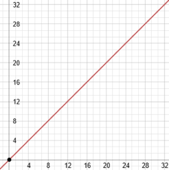
 
Using this function, it is very easy to find the corresponding y value. What if we don’t know anything about the function that produced these 30 pairs? What if the plotted line is not straight but noisy, curved etc.? In this lab first we will generate this simple synthetic dataset with some noise and in the future lab sessions we will look for more complex AML solutions.
 
### 2.2.1 Microsoft Excel
1. Open Microsoft Excel with a blank workbook.
 
2. Type x, y, noise, x, “,” and ywnoise respectively in the first row of the first six columns.    
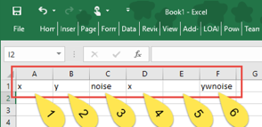
 
3. Starting from the second row to the 31st row of the first column (x), [create a numeric series](https://support.office.com/en-us/article/Fill-data-automatically-in-worksheet-cells-74e31bdd-d993-45da-aa82-35a236c5b5db) starting from 1 to 30.  
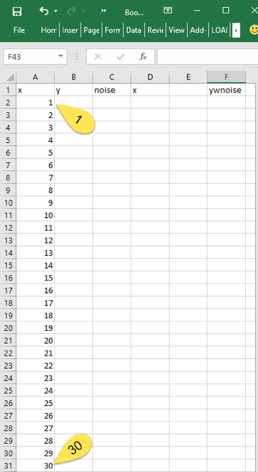
 
4. Copy and paste the values in column x to column y, so both columns will have the same numeric series from 1 to 30. 
 
5. Type the formula “=IF(RANDBETWEEN(0,1), -1 * RAND(), RAND())” on the second row of the column named noise. Drag the fill handle to copy this formula to the rows from 2 to 31. This will generate 30 different random number that range between -1 to 1.  
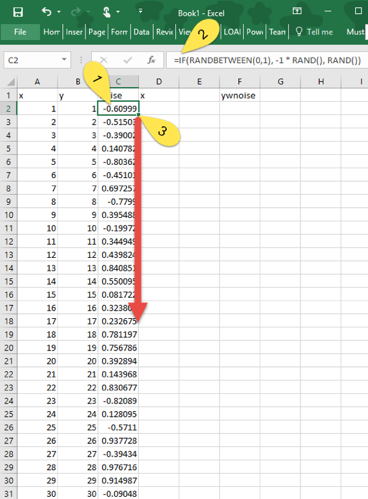
 
6. Type “=A2” on the second row of the D column, “,” on the second row of the column E and “=D2+C2*2” on the second row of the ywnoise named column. Select cells on the second row from columns D to F and drag the fill handle to copy this formula to the rows from 2 to 31.  
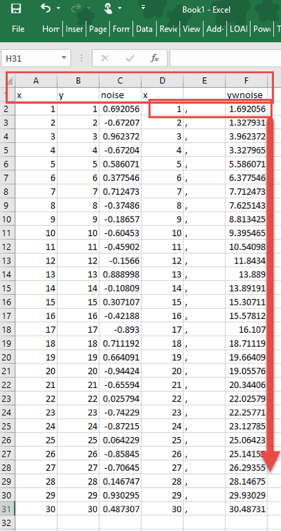
 
7. When you copy the all values from column D to F, you will have 30 comma separated row values with three headers: “x”, “,”,  “ywnoise”.   
  
Plotting column “x” and “ywnoise” will result similar to the following output:  
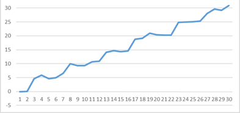  
  
### 2.2.2. R
To generate synthetic data in R, we will use the R studio installed on the local machine. As in the Excel, uniform distribution method will be used to generate random data.

1. Open RStudio program that we installed on the local machine in the previous lab session.  
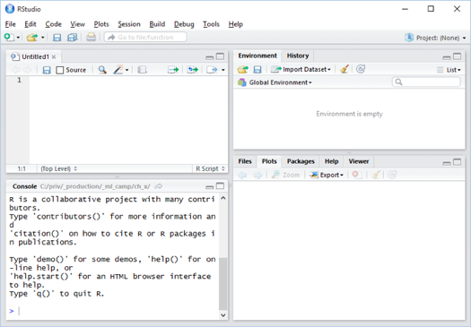  

2. Create a blank R Script file from File -> New menu options and type the following R script in the script editor.

    ```r
    # Generate a numeric series from 1 to 30 and assign it to variable x
    x <- seq(1, 30)

    # Create copy of x as variable y 
    y <- x

    # Generate 30 uniform distributed random number each ranges between -1 to 1
    noise <- runif(30, -1, 1)

    # Create variable ywnoise as in Excel
    ywnoise <- y + noise * 2

    # Plot values of x and ywnoise without labels
    plot(x, ywnoise, xlab = NA, ylab = NA)

    # Combine columns x and ywnoise to create two column grid named linoise
    linoise <- cbind(x, ywnoise)

    # Save the variable linoise as a CSV file on the local disk
    write.csv(linoise, file = "linoise.csv", row.names = FALSE)
    ```  

3. Coding the above script and running it with “CTRL + ALT + R” key combination or by from the menu Code -> Run Region -> Run All, the output will look like:  
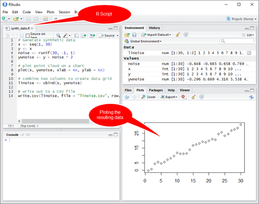  

    You can browse the content of generated CSV file by following the steps shown in the below screenshot.  
    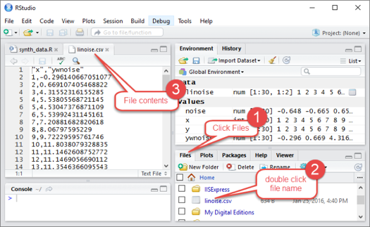  

### 2.2.3. Python
1. Open Spyder IDE (installed with Anaconda Python) on the local machine (Installation steps described in the previous lab).  
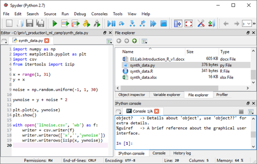  

2. From File->NewFile create an empty script file and type the following Python script in the script editor.  

    ```python
    # Import required libraries to be used. i.e. csv for csv file output, pyplot for plotting etc.
    import numpy as np
    import matplotlib.pyplot as plt
    import csv
    from itertools import izip

    # Generate identical x and y variables with numeric series from 1 to 30
    x = range(1, 31)
    y = x

    # Generate 30 uniform distributed random number each range between -1 to 1
    noise = np.random.uniform(-1, 1, 30)

    # Create noisy y values with magnitude of 2
    ywnoise = y + noise * 2

    # Plot the resulting x and ywnoise data
    plt.plot(x, ywnoise)
    plt.show()

    # Write out the resulting data as a CSV file. Be carefull about the tab indentation which is important for Python.Write out the resulting data as a CSV file. Be carefull about the tab indentation which is important for Python.
    with open('linoise.csv', 'wb') as f:
        writer = csv.writer(f)
        writer.writerow(['x', 'ywnoise'])
        writer.writerows(izip(x, ywnoise))
    ```

3. In the editor window press F5 or from menu follow Run->Run to run the script. Which will generate a file named linoise.csv in the working directory and a plot of the variables.  
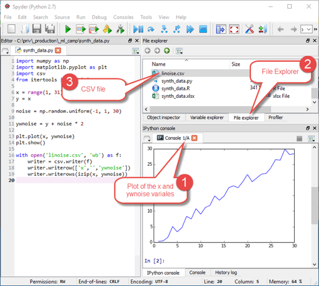  

### 2.2.4. Microsoft Azure SQL Server
1. [Create a Microsoft Azure SQL Database](https://azure.microsoft.com/en-us/documentation/articles/sql-database-get-started) and make appropriate firewall settings to be able to connect from local pc and Azure.

2. You can use any SQL Server management tool (i.e. [Microsoft SQL Server Management Studio](https://msdn.microsoft.com/en-us/library/mt238290.aspx), Visual Studio etc.) to connect to your Azure SQL Server. [Here are the details](https://azure.microsoft.com/en-us/documentation/articles/sql-database-connect-query-ssms/) about how to connect Azure SQL Database. Note the SQL DB name, connection parameters like username password etc.  

    To access connection parameters, you can connect to the Azure management portal and expand the properties of the SQL Database. Under the properties blade either the connection strings or the ServerName, username information can be gathered. Password is not shown in the properties window and it is the one that you set during database creation stage.  
    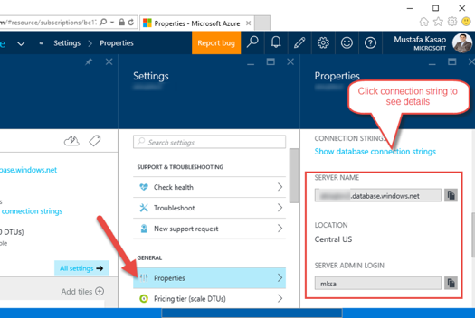  

3. Run the following TSQL Script to create a table and fill it with a numeric series from 1 to 30 along with a noisy data column as we did in Excel sample. We are using basic TSQ commands for better support in other database versions available.  

    ```sql
    --Create a table to be used in our future AML experiment. Old SQL DB version requires clustered index
    CREATE TABLE synth_data 
    (
        x int, 
        ywnoise float
    );
    CREATE CLUSTERED INDEX i1 ON dbo.synth_data(x);

    --Generate sequence of numbers from 1 to 30
    WITH Seq as (
        SELECT TOP (30) x = CONVERT(INT, ROW_NUMBER() OVER (ORDER BY s1.[object_id])) 
        FROM sys.all_objects AS s1 CROSS JOIN sys.all_objects AS s2
    )

    --Insert the sequence and noisy data column into the table
    INSERT INTO synth_data
    SELECT x, x + (RAND(convert(varbinary, newid())) * 2) - 1 as ywnoise FROM Seq
    ```

### 2.2.5 Microsoft Azure Blob Storage
1. [Create an Azure storage account](https://azure.microsoft.com/en-us/documentation/articles/storage-create-storage-account/#create-a-storage-account) and note the account name and the access key. You can get the account name and key (password) anytime from the azure management portal from the Settings blade of the storage account service properties. These information is mandatory to access the storage service.  
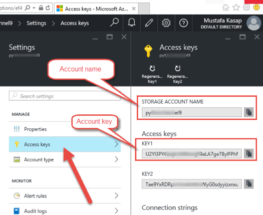  

2. For accessing the Azure storage service easily to upload, download files, data etc. you can use the cross platform open source tool named [Azure Storage Explorer](http://storageexplorer.com/). Download and install the tool on your local machine.  

3. Open the Azure Storage Explorer app that you installed. From the main window, right click on “Storage Accounts” node and then click on the “Attach External Storage” pop up menu item as shown in the below screenshot.  
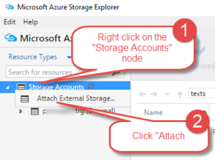  

4. In the pop up window “Attach External Storage…” type the account name and account key information that you noted while creating the storage account (step 2).  
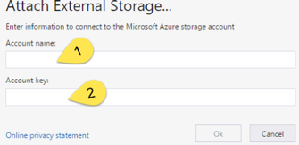  

5. After having your account added to the list, expand the node by double clicking on the account name (shown on the below image with red rectangle) and right click on the “blob containers” node then click “Create Blob Container” as shown below. This will create a container (like a folder) under your storage service.  
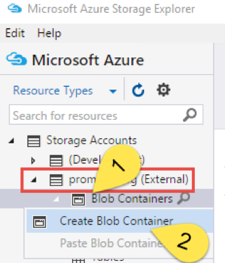  

6. After you created a container, click on the container name node, and on the menu options select “Upload” to upload the local CSV file that we created with R or Python scripts in the previous steps.  
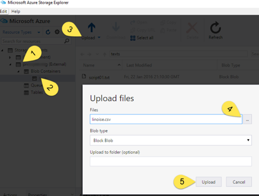  

7. Once the file upload completed successfully, you can right click on the file name and “Copy URL to Clipboard”. Without account key, you can’t access the file, but we will use this URL address and the noted account keys in the future AML experiences.  
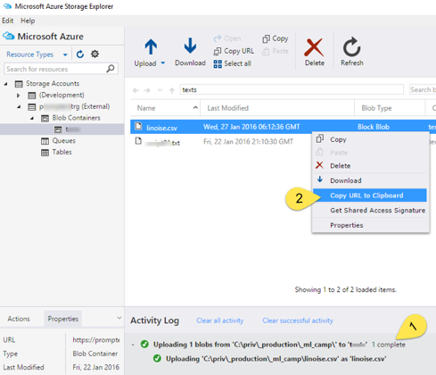  

8. Unless you right click on the container name and make its access level public from the properties menu item, it is not possible to access this data with the URL address without the access key. So your data is secure and private.  

## 2.3. Other Dataset sources
AML Studio has pre-loaded ready to use datasets. You can access the details of these datasets and their description from the following [link](https://azure.microsoft.com/en-us/documentation/articles/machine-learning-use-sample-datasets/). Some of these datasets are retrieved from [University of California Irvine Machine Learning repository](http://archive.ics.uci.edu/ml/index.html) (UCI). In the future AML experiments, you may want to use existing CSV files on Internet as a datasource of your ML model. i.e. Forest Fires Dataset referred under UCI has the access link http://www.dsi.uminho.pt/~pcortez/forestfires/forestfires.csv. In AML you can directly access this data without copying it into SQL Server or Storage service etc. Having known the existence of online datasets mentioned it is a good idea to browse available set from the [link](https://azure.microsoft.com/en-us/documentation/articles/machine-learning-use-sample-datasets/) before starting to develop AML solutions.  
