# 8. Recommendation System

## 8.1. Overview
In this lab we will deploy Recommendation system on Azure Machine Learning system. In this deployment we will try to identify the logic behind the mathcbox recommender model which is the embedded recommendation solution in Azure ML Studio. Keeping in mind that there exist custom recommendation solutions available with R and Python scripting, we will focus on Train and Score MatchBox Recommender modules ready to use in AML. In case you are interested in technical details of this model, you may refer to [paper](http://research.microsoft.com/apps/pubs/default.aspx?id=79460) published by Microsoft Research. This recommender system finds association rules between users and items or within items itself or users itself. It can help to identify:
    - Related items. i.e. Item A considered together with item B 
    - Related users. i.e. User A has similar tendency as user B
    - Item recommendation to specific or new users. Here the items may be DVDs, restaurants, bicycles, foods etc.
 
### 8.1.1. Objectives
### 8.1.2. Requirements

## 8.2. Generate synthetic data
To be able to make some analysis at first sight, using Microsoft Excel we will generate small amount of a sythetic data and create a test experiment using the Matchbox Recommender modules. We will create three CSV files (tables of data), 1) users.csv 2) items.csv 3) ratings.csv with following content (check the appendix folder for a copy of the files):

**users.csv**
 
| customerId | type |
| --- | --- |
|c1	| v |
| ...	| ... |
|c7	| mv |
|c8	| m |
 
**items.csv**
 
| restaurantId | type |
| --- | --- |
| r1	m
| ... | ... |
| r5 | v |
| r6 | mv |

 
**ratings.csv**
 
| customerId | restaurantId | rating |
| --- | --- | --- |
| c1 | r2 | 3 |
| c1 | r3 | 1 |
| ... | ... | ... |
| ... | ... | ... |
| c8 | r6 | 2 |

Visual illustration of the above tables is:  
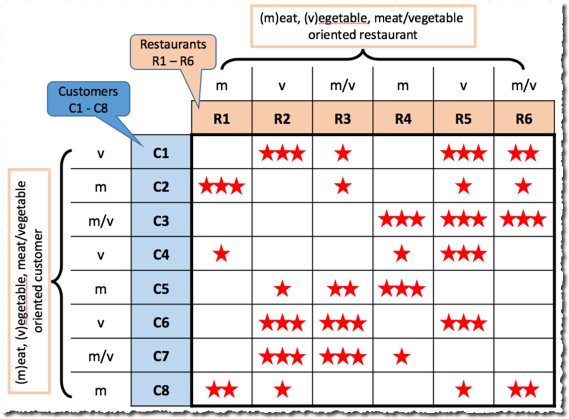 

To use matchbox recommendation system we need **at least the ratings table**, other tables are just optional (use either the ratings table or the triplet). In case using all tables, matchbox recommender will work in **collaborative filtering mode**, which means the features of the items and users will be taken into consideration in the recommendation process. 

    - Note: In the above synthetic data, we conciously select the very distinguishing features like vegeterian, grill restaurant etc. In the matchbox recommendation system, especially with this small amount of training data, it doesn't mean that the system will not recommend a grill restaurant to a vegetarien person! With big enough, quality data it is possible to succeed logically expected results but with very small amount of training data it is not always the case. 

 Lets start explore the recommendation system by using the above information, data tables.

## 8.3. Recommend items to users
1. Create a blank experiment.  

2. Build the following workflow.  
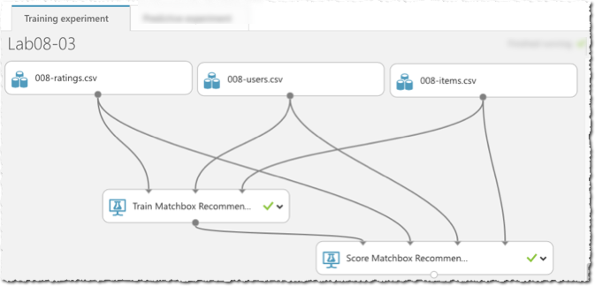 

3. Set the *Train Matchbox Recommender* module's **Number of Traits** property to 3. This is generally equal to the maximum number of ratings per user, which is 3 in our case.  
 

4. Set the *Score Matchbox Recommender* module's **Recommender prediction kind** property to "Item Recommendation" and **Recommended item selection** property to "From all Items". Also set the "Maximum number of items to recommend..." to **3**.   
 

5. Run the experiment and visualize the output port of the *Score Matchbox Recommender* module.
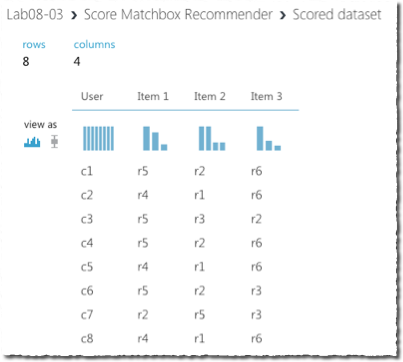   
    In the output window, first column lists all the users and in order next columns shows the recommended items to that specific user in the same row.
    
    As we set the *maximum number of items to recommend* to 3, system tries to recommend the most appropriate first 3 item. Also If we look closer to the first row, we can see that the 3rd item (column with name Item3) recommended for the first user is **r6** which is the most appropriate choice within the available set but lets **try the next step**. 

6. Add the below two new rows of data into the ratins.csv file, that you will replace with the existing one, or you can simply use "Enter Data Manually" module and copy/paste whole new CSV content into this moudule.  
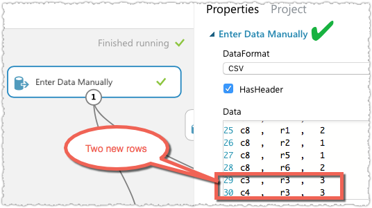  

7. "RUN" the experiment again and visualize the output port again.  
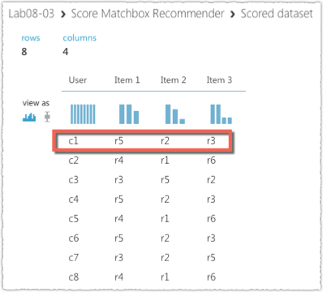  

8. You will see that the recommended third item is changed from **r6** to **r3**. This is mainly because other users (two new rows that we added) with similar profile liked **r3** so much. So the system propose **r3** again to the customer **c1** (even he/she already rated it with one star before).

9. What if we set the parameter to *From Rated Items (...* and "minimum size of recommendation pool..." to *4*?
 

10. Set the parameter values as above and Run the experiment, visualize the output port of the score matchbox recommender module.  
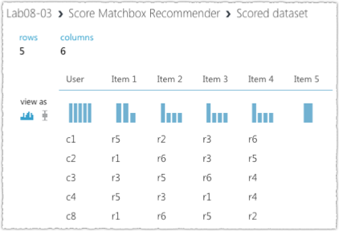 

11. Here you can see that the system recommends aonly from a pool of items that user rated. Also there is no recommendation for user *c5, c6, c7*. Because these users rated less than four item but our pool condition parameter set to *4* in the above property window.  
    
12. You may observed the two similar property value in almost all *Recommender prediction kind* type. These two options are either "From Rated Items" or "From All Items". In production mode, when you publish the solution as web service, your model property should set to "From All Items" but if you are evaluating the system, testing it etc. you can switch to "From Rated Items" to see if your model works as expected based on the existing rating information.   

## 8.4. Related users
Assume you want to match your users', customers' profiles, try to find related users or users that have similar tendency. In such case you may use the "Related Users" value set in the **Recommender prediction kind** property.  

1. Set the *Recommender prediction kind** property to "Related Users"  
 

2. Run the experiment and visualize the output port.  
 

3. As you can see from the output, in order users c4, c6, c7, c3, c5 are related with user **c1**. If you check our data tables or the visual illustration of the user-item-useritem ratings triplets, you will see that users **c4, C6** and so forth, all like vegetables like user **c1**. Also as we constrained our system to propose 5 recommendation, it proposed user **c5** related to user **c1** even the profile is grill. Becuase c5 rated the same item (restaurant) as c1 (event dont liked it).

## 8.5. Related items
Similar to the experiment in the previous lab session, it is possible to find related items. This approach can be used to recommend items to a user based on the related items. i.e. if item X and Y have similar profile or X and Y bought together, then you may recommend item Y to a user who bought or selects item X.

1. Set the *Recommender prediction kind** property to "Related Items"  
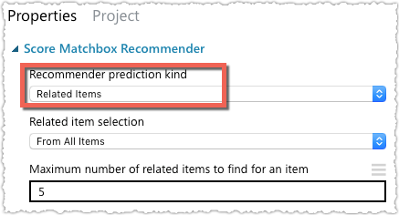 

1. Run the experiment and visualize the output port.  
  

1. You will see the grill restaurants are related to each other and vegeterian restaurants too.  

## What to recommend for a new user?
Above samples are using existing users. i.e. recommending a new, second or third item to buy to an existing user in the system. Or to advertise second, third related items to the one that the user is viewing etc. What about if we have a new user registered to the system but haven't made any rating yet? To be able recommend items etc. for a new user, you should definitely work with input data triplet (with optional data, users and items available). Also you must have the features of the new user (In our case it is the type column of the user table). Now lets develop a recommender system for new users:

1. Set parameters of "Score Matchbox Recommender" to **3** with below settings.  
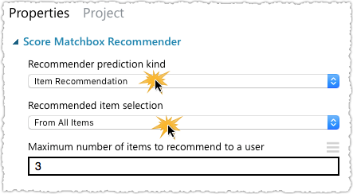  

2. Run the experiments.  

3. Create a predictive experiment.  
  

4. Add second web service input module as in the below workflow and Run the predictive experiment.
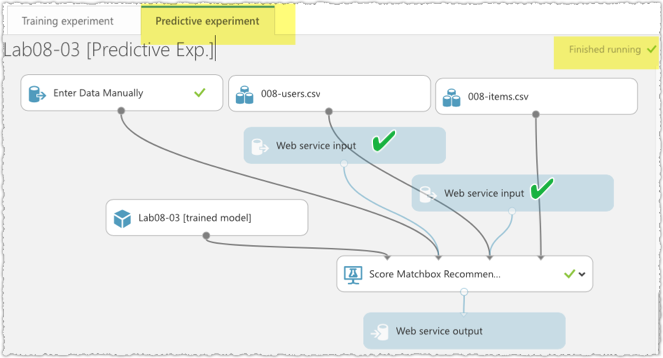  

5. Deploy the web service.  
  

6. Published web service dashboard will open. Because we have more then one webservice input, we cant use the "Test dialog input". So we will click on the "Excel app" link to download sample excel file|application to test our web service.   
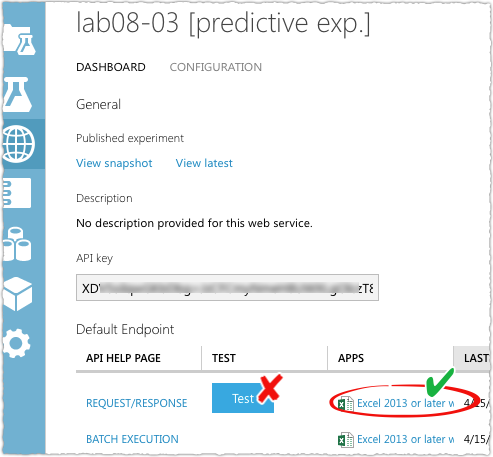  

7. Download the Excel file and open it. (You should click "enable content" button in case your computer's security doesnt allow to open Excel apps)

8. Click on the webservice name on the excel.
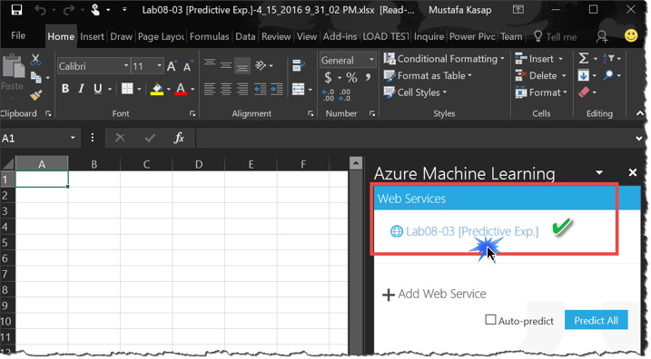  

9. On the top row of the excel sheet, in order, write the following values in each cell as in the below screenshot.
  
| A         | B   | C        | D          | E    |
| ---       | --- | ---      | ---        | ---  |
|customerId |type |customerId|restaurantId|rating|
| NEWC01    | v   | NEWC01   |            |      ||
 
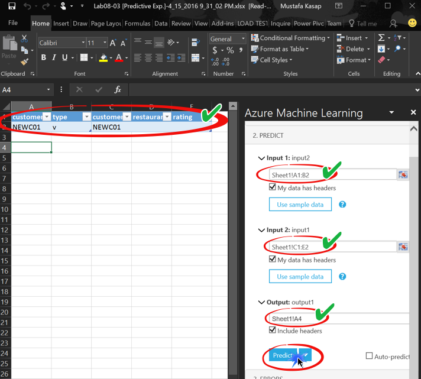  

10. As there are two web service input, you need to enter the user id two times (you can fine tune input parameters with project column etc. modules as we did in earlier lab sessions). New user **must have** unique userid (custumerId) that does not exist in the training data. So we used **NEWC01** as our new user id. Also as mentioned earlier, new user data must contain the feature vector, feature values. In our case feature data is **v** which means the customer is vegeterian or like vegetable plates. You keep the ratings data empty (except the same unique id). Now adjust the Excel web service app's parameters. You need to specify the source cells for the web service's input output ports. Type "Sheet1!A1:B2" for first webservice input (input1), "Sheet1!C1:E2" for input2, end type "A4" for the address of the cell where the webservice output will be printed. Finally press *Predict* button.  

11. Result is not surprising. For a new user who is vegeterian or whos feature is simple **v**, recommended restaurants are in order: r5, r2, r3!. Which are vegeterian or vegi oriented restaurants.   
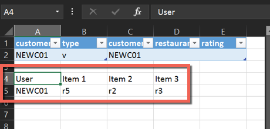  
