# 9. Monetizing Azure ML Solution

## 9.1. Overview
In the previous labs we learned how to develop and deploy an Azure Machine Learning solution as a web service. Using the API key (password) and the web service URI anyone can access the solution and consume it from almost any type of application. Having single API key, how it is possible to share the service with multiple users, consumers? How to track the number of API calls per specific user? How to limit the API calls to a specific number? How to limit the access to your service with basic, OAuth etc. authentication? Is it possible for a user to consume the service with his/her facebook, microsoft or other accounts? etc. 

In this lab we will try to answer above like questions and explore how to integrate with Azure Management API, one of the widely used method, to monetize your AzureML solution.  
 
### 9.1.1. Objectives
This lab aims to demonstrate how to monetize Azure ML solution with Azure Management API service. Explores the development stages of a sample end to end solution to monetize your AzureML webservice.

### 9.1.2. Requirements
1. Knowledge of AzureML web service deployment ([Lab 4.2.2.](./004-lab-azureml-experiment.md)).

## 9.2. Web Service Details
Before going into the details of integrating Azure Management API, lets have your Azure ML web service operational and have access details ready. Because everything will built on top of an Azure ML Web service. In this lab we will use the Azure ML solution with web service that we created on [Lab 4.2.2.](./004-lab-azureml-experiment.md). If you havent completed it yet, please do so or have another Azure ML web service ready.  
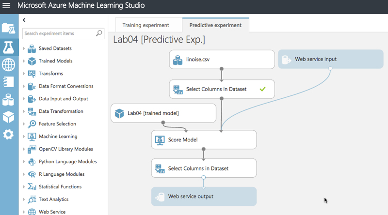  
1. Publishing the above AzureML solution will open the WebService dashboard. If you already published it before, just goto the Web services tab and open its dashboard. Here we will note three important information to be used in Azure Management Portal
    - ## API key
    - ## Request URI
    - ## Sample Request

1. Note the **API key** (password to access) of the web service.  
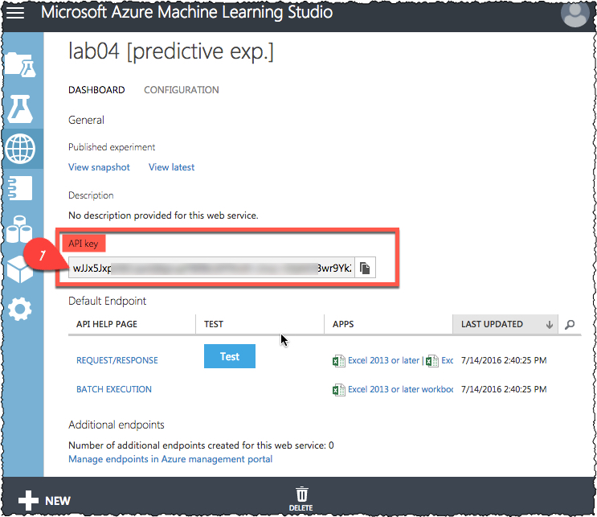  

1. Click on the **REQUEST/RESPONSE** link to open the API Help Page.  
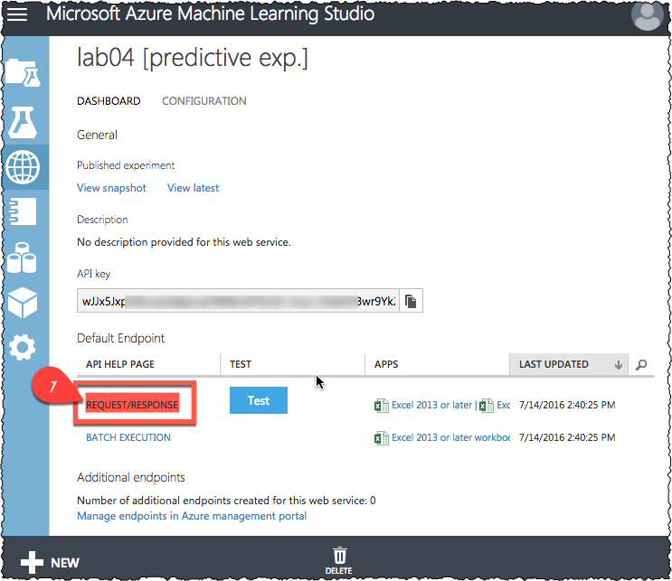  

1. Note the Request URI shown on this page.  
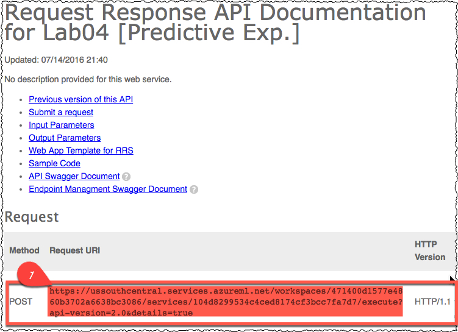  

1. Scroll down on the **REQUEST/RESPONSE** and copy the **Sample Request** code.
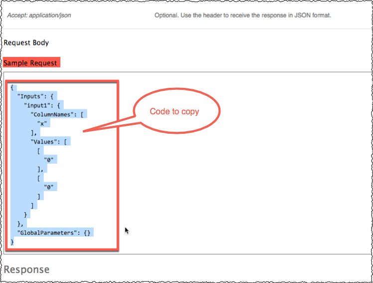  

1. In the next steps we will use these **API key**, **Request URI** and **Sample Request** information in the Azure Management API service.

## 9.3. Create Azure Management API Service
We will use Azure Management API service as an additional layer between our applications and the original Azure ML web service. This layer will create an additional security (not sharing the only one API Key with every user etc.) and will give the flexibility to manage access scenarious that we will mention.

1. Login to [old Azure management portal.](http://manage.windowsazure.com)  

1. Create an Azure Management API service from the old Azure Portal by clicking **NEW** button on the lower left corner (the time of writing this HOL, old portal is the only option to create this service).  
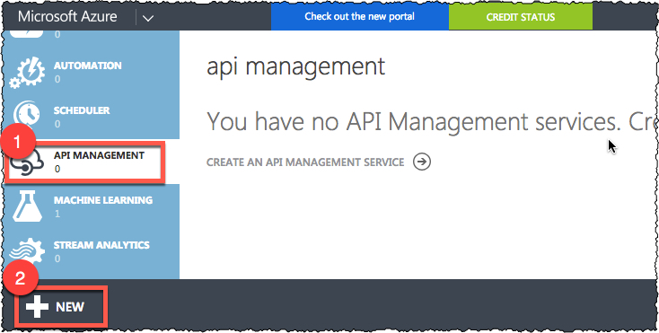  

1. Click **Create** button.  
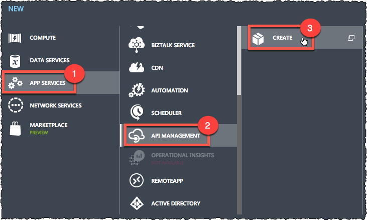  

1. In the *Wizard* window enter requred information. Here the newly created URL address will be your new webservice address. Instead of https://ussouthcentral.services.azureml.net/workspaces/471400d157..........086/services/104d8...534c... like very long address, you will be using https://amlhol.azure-api.net like address.  
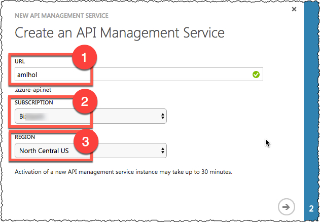  

1. Enter an organization name where not only this but also other ML or whatever APIs you want to be listed under. So your users that you will create or register under this organization can see these APIs under this org name and be subscribed to them. Click on the **Advanced Settings** checkbox.  
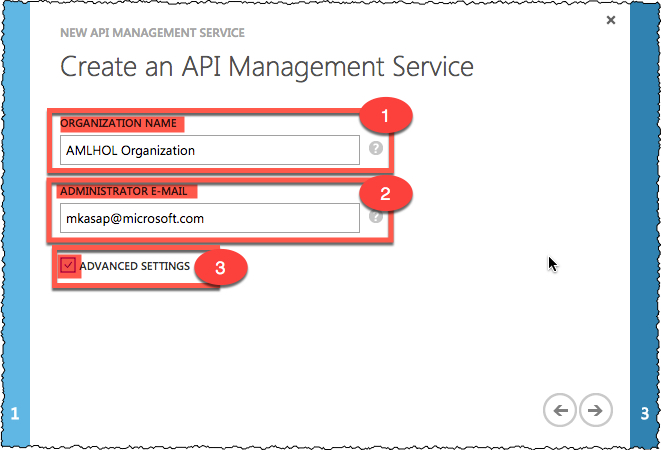  

1. Select **Developer tier** to be able to use or see all available features. Click on the button with check mark on the bottom right corner to create the service.  
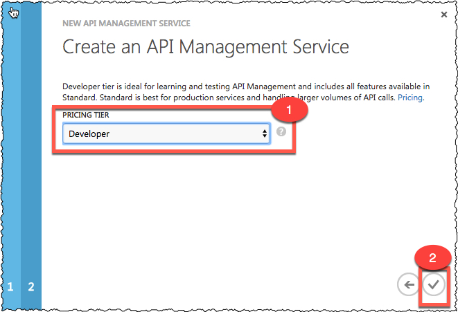  

1. It will take few minutes to create the service. Once the status of the service become **Ready**, click on the **Manage** button on the bottom bar.  
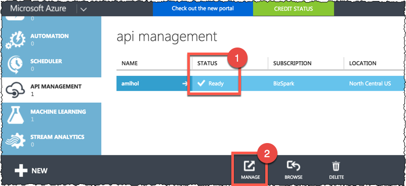  

1. In the API Management page, click on the **APIs** link and then click on the **ADD API** link.  
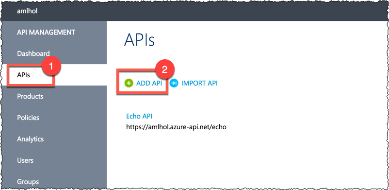  

1. Fill in the create API form. You can write any descriptive name to your API in the **Web API name** field. In this API namespace (https://amlhol.azure-api.net/) there may be more then one service. To identify this specific service give any name as a suffix in the **Web API URL suffix** field.  In the **Web service URL** field copy and paste the **Request URI** value that you noted in section **9.2.** But do not paste the suffix part of the **Request URI**.
i.e. if the URI is:  
*https://ussouthcentral.services.azureml.net/workspaces/4714.......bcc7fa7d7/execute?api-version=2.0&details=true*  
then just copy the following part:  
*https://ussouthcentral.services.azureml.net/workspaces/4714.......bcc7fa7d7*  
we will use the below suffix part in the following stages.  
*/execute?api-version=2.0&details=true*  
after all, you can press the save button to create the API and goto the operations page of the API.  
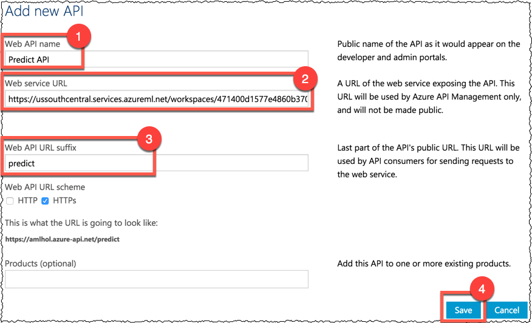  

1. On the **Operations** page, click on the **Add Operation** link.
  

1. On the **Signature** tab of the operations page select **POST** method in the **HTTP web** field.  
Enter any URL template (in this sample we will use **/score**) that will be replaced with the suffix ***/execute?api-version=2.0&details=true*** we noted in the previous step.  
Enter the ****/execute?api-version=2.0&details=true**** suffix in the **Rewrite URL template** field.  
You can customize the **Display Name** field with any value, otherwise it will be same as the **URL Template** value.  
After all press the save button.
  

1. In the *Body* page of the *Operations* tab of the API, click on the **Add Representation** link.  
  

1. Here type **application/json** and press *Enter*  
  

1. In the **Representation example** field paste the **Sample Request** value that we noted in the above section **9.2.**
  

1. Now switch to the **Policies** tab in the *API Management* page. Select **Predict API** and the **/score** operation in the combo boxes. Finally click on the **Configure Policy** link. On this page you can do lots of fun staff to customize your API.   
  

1. After you click on the **Configure Policy** link, the *Policy definition* field will become editable.  
Press *Enter* key to create a blank line under **\<inbound>\<base/>** tags as shown in the below screenshot.  
In the **Policy statements** list, scroll down to find the **Set HTTP header** policy template in the list. Click on the arrow button near it. This will add the policy template under **\<inbound>\<base/>**.
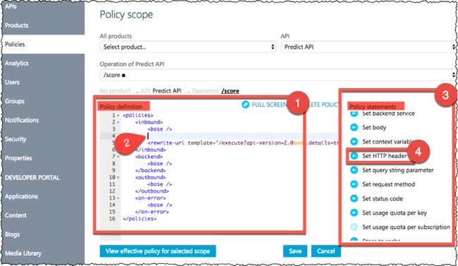  

1. After adding the template, it will look like: 
``` xml
<policies>
	<inbound>
		<base />
		<set-header name="header name" exists-action="override | skip | append | delete">
            <value>value</value> <!-- for multiple headers with the same name add additional value elements -->
        </set-header>
		<rewrite-uri template="/execute?api-version=2.0&amp;details=true" />
	</inbound>
	<backend>
		<base />
	</backend>
	<outbound>
		<base />
	</outbound>
	<on-error>
		<base />
	</on-error>
</policies>
```
1. Update the above policy template with the **API Key** that you noted in section **9.2.** Your **API Key** should be typed immediately after the **Bearer** keyword with a preciding space character as shown below.
 so it will look like as (Below sample uses random API Key):

``` xml
<policies>
	<inbound>
		<base />
		<set-header name="Authorization" exists-action="override">
            <value>Bearer wJJx5JxpO6C......Tey2Zu/tzJpo+p5DWRg==</value> <!-- for multiple headers with the same name add additional value elements -->
        </set-header>
		<rewrite-uri template="/execute?api-version=2.0&amp;details=true" />
	</inbound>
	<backend>
		<base />
	</backend>
	<outbound>
		<base />
	</outbound>
	<on-error>
		<base />
	</on-error>
</policies>
```

1. Finally click the **Save** button to save all these changes and finalize our API settings.  
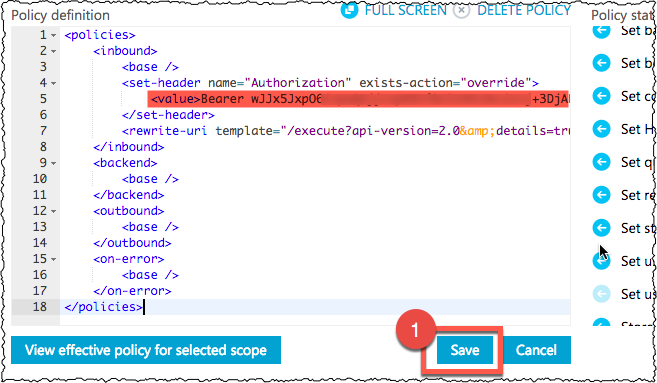  

## 9.3. CORS issue with Azure Machine Learnin Web Services
If you want to access your Azure ML web service from a different domain, by default Azure ML doesnt allow this because of security reasons. This is known as CORS issue and demonstrated with the below diagram.  
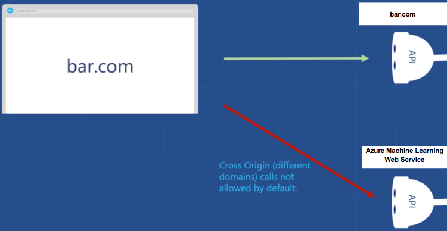  
If you want to access an Azure ML web service from a different web site trhought Javascript etc. you need a proxy solution where Azure Management APIs is also one of the solution to this problem. If you need more details about the CORS, you may refer the following [video](https://channel9.msdn.com/Blogs/AzureApiMgmt/CORS-and-API-Management)  
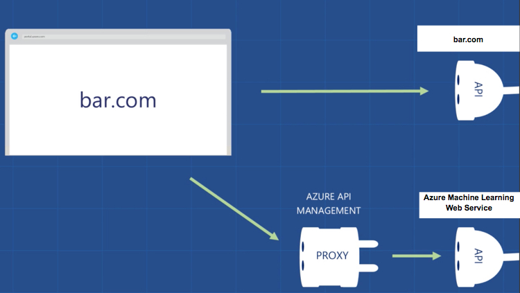  

Going back to our lab, follow the instructions below to enable the CORS support for your Azure ML web service.

1. As in the step **9.2.16** configure the policy and add the following lines under **\<inbound>\<base/>** tag. You can either enter manually or use the *CORS* item under **policy statements** to insert it.  
``` xml
		<cors>
			<allowed-origins>
				<origin>*</origin>
			</allowed-origins>
			<allowed-methods>
				<method>*</method>
			</allowed-methods>
			<allowed-headers>
				<header>*</header>
			</allowed-headers>
		</cors>
```
This will allow any method, any IP address to acces from cross origin. Above settings doesnt have any restriction and generally you have to make modification on it to have secure web apps. Refer to the [following address](https://azure.microsoft.com/en-us/documentation/articles/api-management-policy-reference) to read more details on policy settings.

## 9.4. Restrict or Rate limit your Web Service  
If you want to go a bit forward add some rate limit functionality etc. you may refer to the tutorial at the following address
https://azure.microsoft.com/en-us/documentation/articles/api-management-howto-product-with-rules/. It is as simple as modifying the policy configuration file that we did in section **9.3.*

## 9.5. Test and Publish your Web Service
Before we can use the API, we need to put the API (plus other related APIs if we have) in to a product package and give access rights to our users through this product.

1. Open the **Products** page and click on the **Add Product** link.  
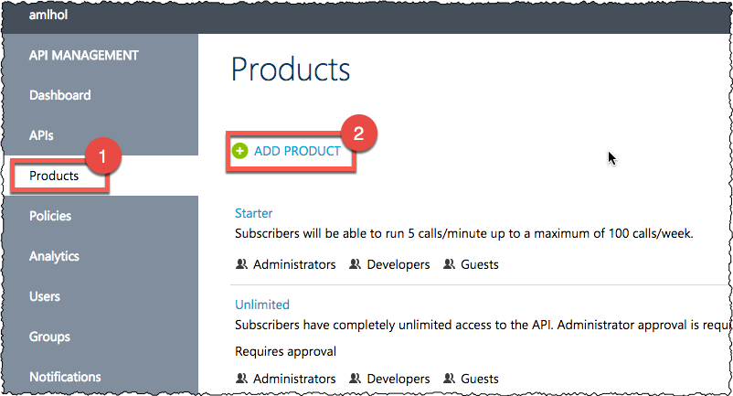  

1. Fill in the form with required information. You can give any name and description to your product and save it. Regarding access rights, defined users in your organization (see the users, groups tabs under API Management page, a page like the APIs, Policies) can access the product once they get subscribed and there is no approval etc required. If you check other checkboxes you can set approval etc.  For this sample we will use default values.  
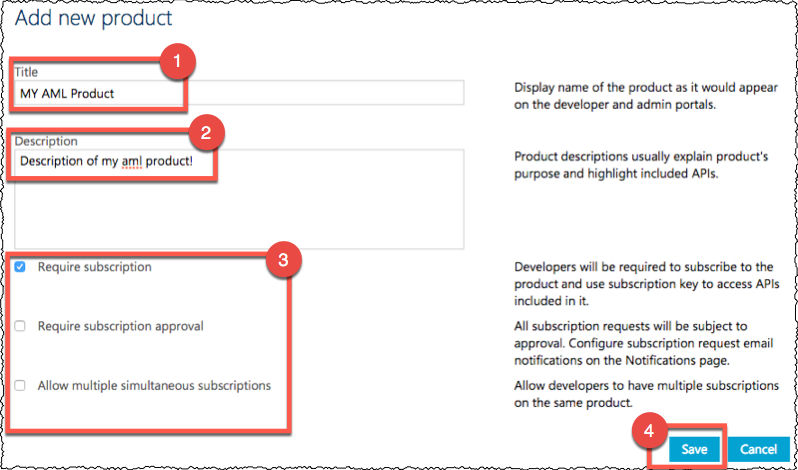  

1. After the product is created, click on the product name link to open its details. As you can see from the screenshot, by default Administrator has the access rights. For adding other users, user groups etc. you can explore the Users and Groups pages.  
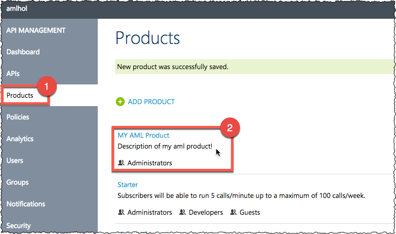  

1. On the details page, click on the **Add API to Product** link.
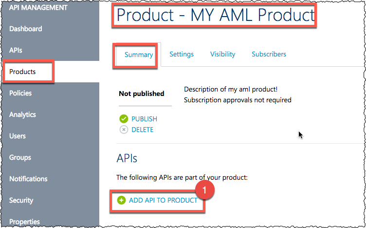  

1. Select **Predict API** in the list and click **Save**.  
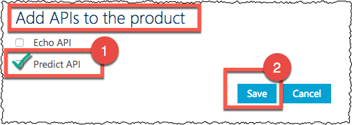  

1. Now on the same page, click on the **Publish** button to publish our product with one or more APIs inside. On the same page you can modify the settings such as **Visibility** so only selected users, groups etc. will see the products.  
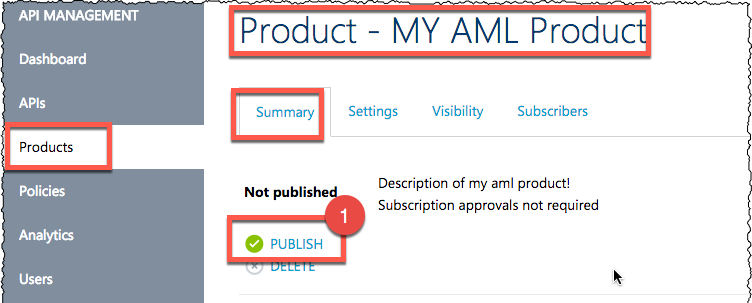  

1. It will be published after the approval.  
  

1. Now we can test our API. Click on the **Developer portal** link on the top right corner of the page.
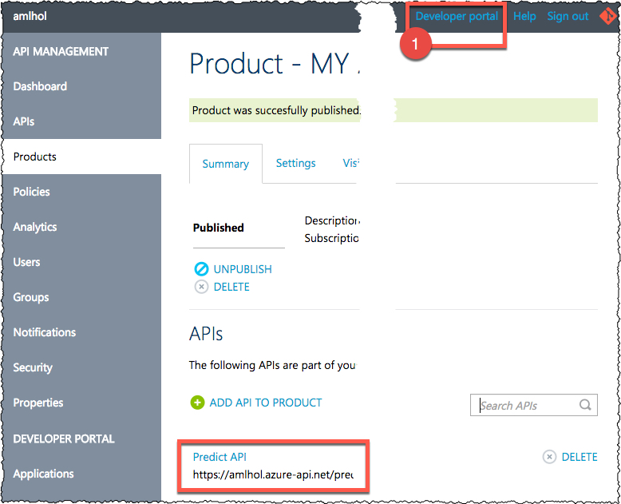  

1. On the new page, click on the APIs (or products then click on our newly created product) link.  
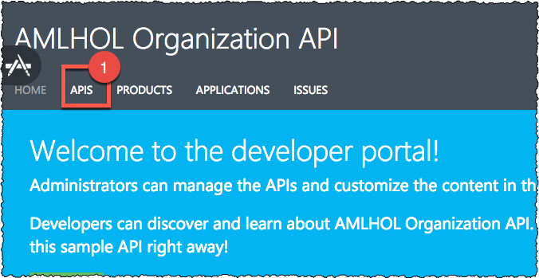  

1. Click on the **Predict API** link to open its test page.  
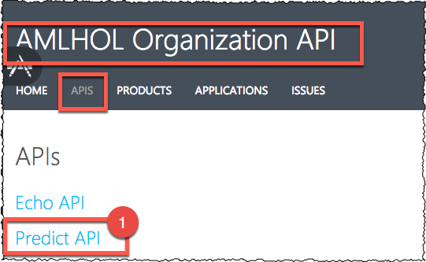  

1. Click the **Try It** button on the page.
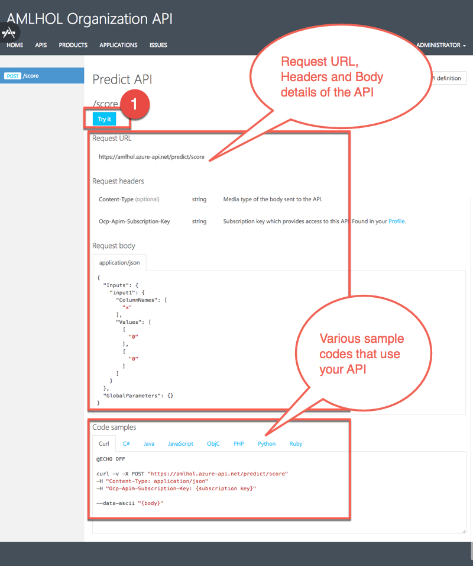  

1. On the test page, you can edit the **Request body** and enter some custom values to be sent to the Azure ML web service. then click on the **Send** button at the bottom of the page. As shown on the below screenshot, subscription key is entered by default. This key is different then the one in Azure ML webservice portal. This key is specific to the current user, which is *administrator*. From the **Users** page of the API management portal, you can see/change user specific keys anytime.  
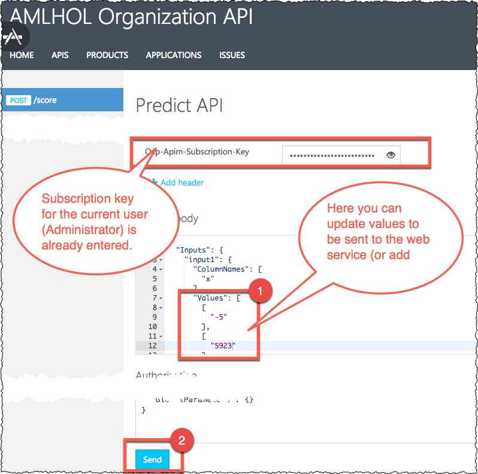  

1. Few seconds after you click on the **Send** button, you will see the response from the API call.
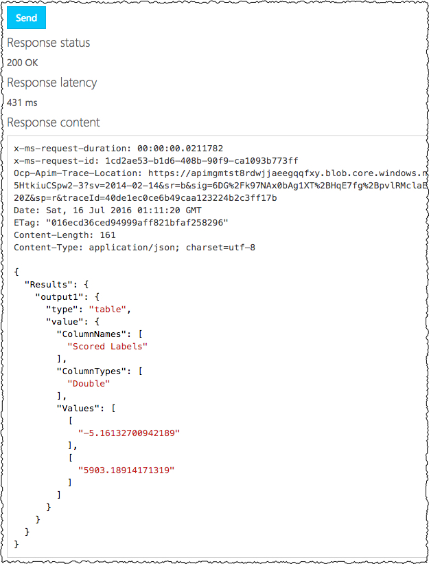  

You can use the full code samples mentioned in the previous steps to test your API in a real application. You just need a Subscription key, which you can find under the **Users** page.
